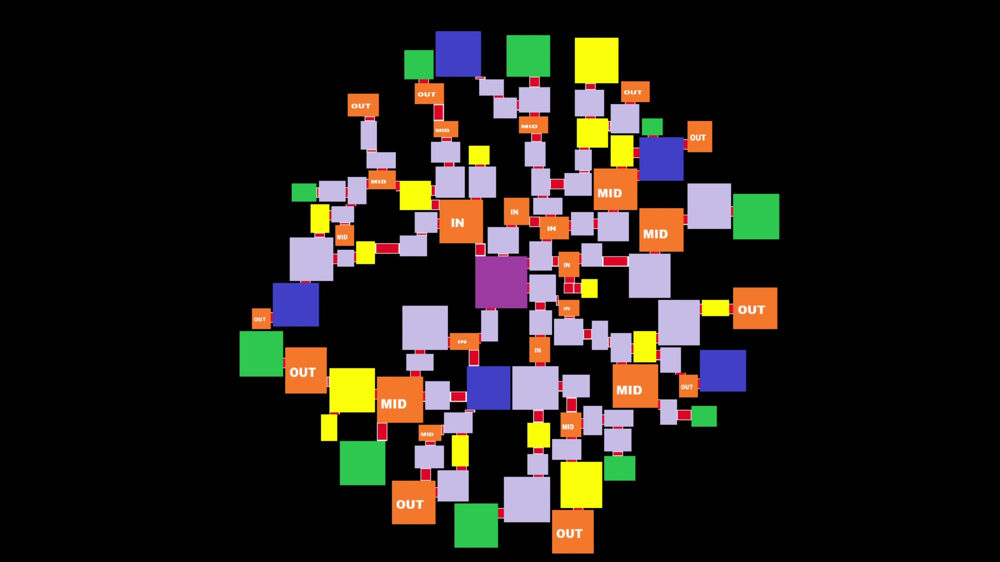
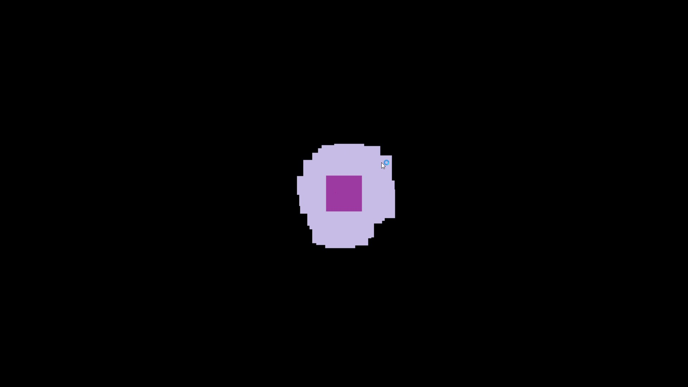
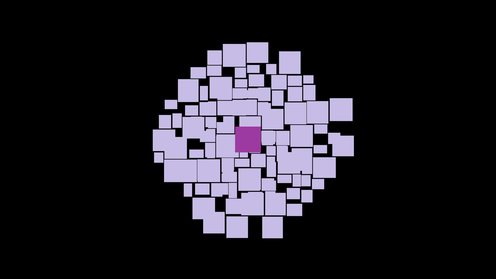
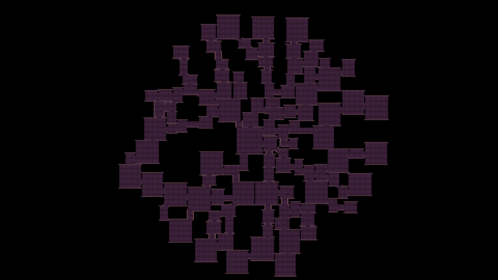
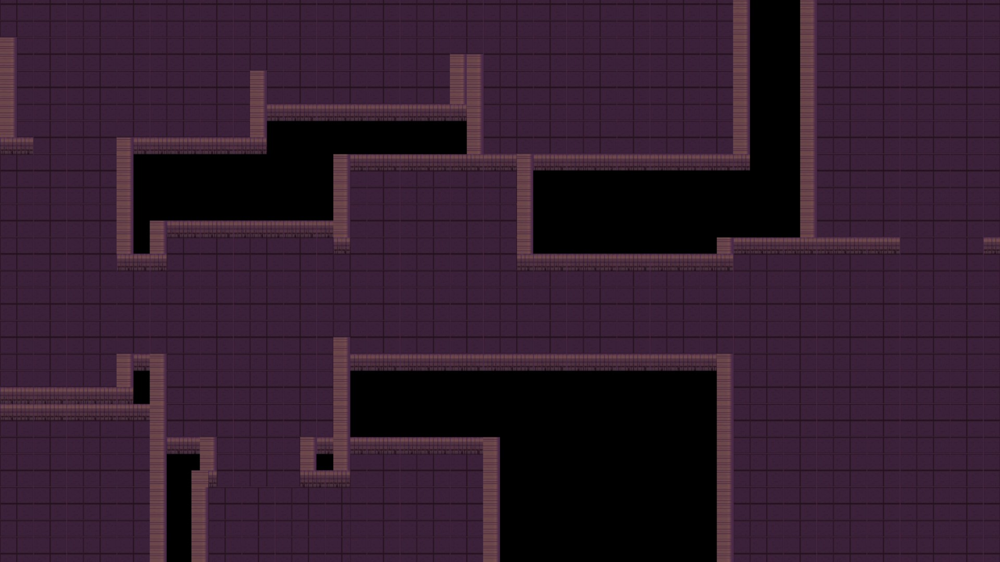

# Random Dungeon Generator

A 2D procedural, unique and random dungeon generator that arranges rooms in concentric layers, all paths leading to a central boss room.

🟩Spawn rooms in the outer ring, 🟨event and 🟦small boss rooms scattered throughout, and a 🟪boss chamber dominates the centre. The default rooms fill the gaps.

Very slow due to rendering. It can be optimised to provide only the numerical values describing the resulting dungeon.

Built in C++ using SDL2.

---

## 🎥 Demo

  
*Click to view the full generation process in action.*

---

## 📸 Screenshots

| Room cluster | Room spreading | Rooms and Bridges | Texturing | Rooms zoomed |
|:----------------------:|:--------------------:| :--------------------:| :--------------------:| :--------------------:|
|  |  |  |  |  |

---

## 🛠️ Setup & Run

1. **Clone or download** this repo (ZIP)  
2. **Open** `Masterclass.sln` in **Visual Studio**  
3. Switch to **x86** configuration  
4. Build & **run** `main.cpp`  
5. **Important:**  
   - _Do not_ click or press any keys during generation—input will pause the process.  
   - After generation finishes, click once in the window, then use **← ↑ → ↓** to explore.

---

## ⚙️ How It Works

1. **Room Generation**  
   - Create random-width rectangles at the origin.  
2. **Spreading**  
   - Iteratively move rooms outwards until no collisions remain.  
3. **Role Assignment**  
   - Calculate each room’s distance to center; assign Spawn/Event/Default/Boss.  
4. **Pruning**  
   - Randomly delete a subset of default rooms to add variety.  
5. **Connectivity**  
   - Apply Delaunay triangulation (third-party library) to generate room triples.  
   - Carve bridges between selected triples.  
6. **Texturing**  
   - Apply floor and wall sprites per room.  
7. **Interactive Camera**  
   - Zoom in; after a single click, use arrow keys to navigate the completed dungeon.
---
## 🙏 Acknowledgments

- **Delaunay Triangulation**: This project uses a triangulation algorithm taken from [msokalski's GitHub repository](https://github.com/msokalski/delabella).
