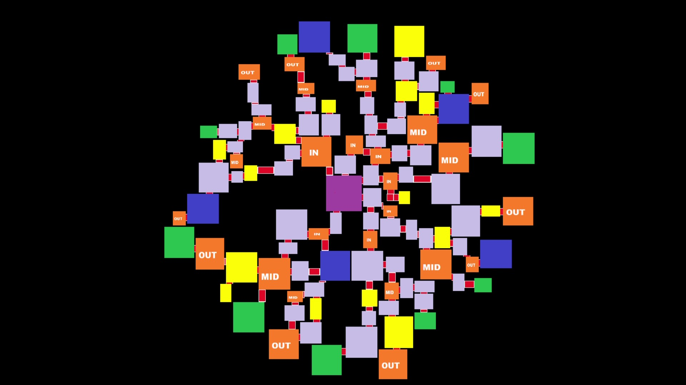

# Random Dungeon Generator

A 2D procedural dungeon generator that arranges rooms in concentric layers, all paths leading to a central boss room.

Spawn rooms in the outer ring, event and small boss rooms scattered throughout, and a boss chamber dominates the center. Default rooms fill the gaps.

Very slow due to rendering. Can be optimized to only provide the numerical values describing the resulting dungeon.

Built in C++ using SDL2.

---

## 🎥 Demo

[](media/dungenDemo.mp4)  
*Click to view the full generation process in action.*

---

## 📸 Screenshots

| Room cluster | Room spreading | Rooms and Bridges | Texturing | Rooms zoomed |
|:----------------------:|:--------------------:| :--------------------:| :--------------------:| :--------------------:|
|  |  |  |  |  |

---

## 🛠️ Setup & Run

1. **Clone or download** this repo (ZIP)  
2. **Open** `Masterclass.sln` in **Visual Studio**  
3. Switch to **x86** configuration  
4. Build & **run** `main.cpp`  
5. **Important:**  
   - _Do not_ click or press any keys during generation—input will pause the process.  
   - After generation finishes, click once in the window, then use **← ↑ → ↓** to explore.

---

## ⚙️ How It Works

1. **Room Generation**  
   - Create random-width rectangles at the origin.  
2. **Spreading**  
   - Iteratively move rooms outwards until no collisions remain.  
3. **Role Assignment**  
   - Calculate each room’s distance to center; assign Spawn/Event/Default/Boss.  
4. **Pruning**  
   - Randomly delete a subset of default rooms to add variety.  
5. **Connectivity**  
   - Apply Delaunay triangulation (third-party library) to generate room triples.  
   - Carve bridges between selected triples.  
6. **Texturing**  
   - Apply floor and wall sprites per room.  
7. **Interactive Camera**  
   - Zoom in; after a single click, use arrow keys to navigate the completed dungeon.

---

## 📂 Repository Structure
```plaintext
├── docs/ # Demo images & video thumbnails
├── src/ # C++ source code
│ └── main.cpp
├── include/ # .h files
├── Masterclass.sln # Visual Studio solution
└── README.md
```
